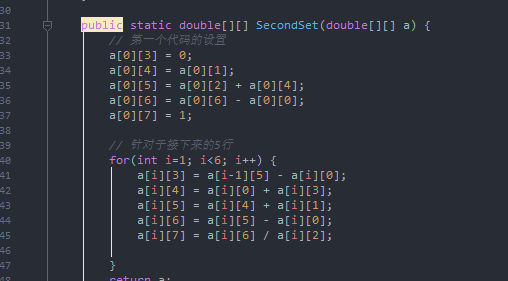
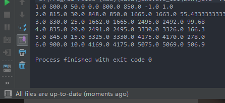
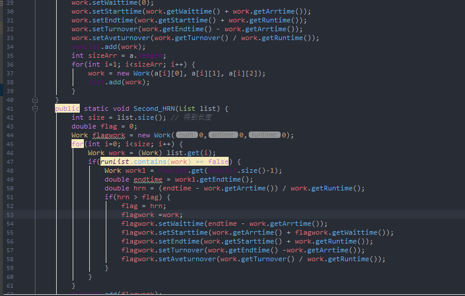
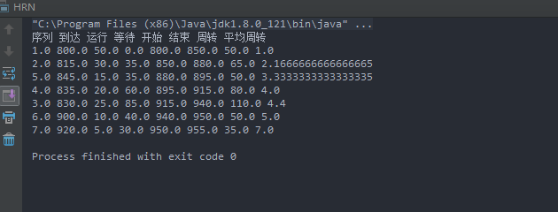
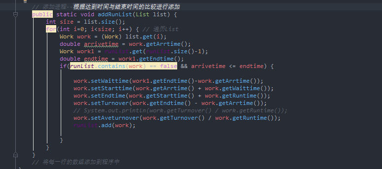
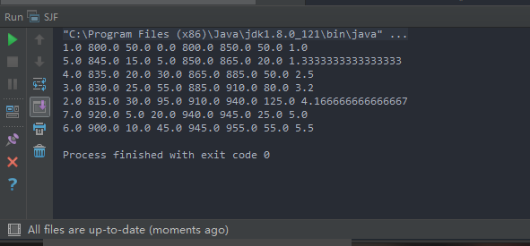

### 实验内容
---

#### 实验题目
操作系统的作业调度算法主要有FIFO，短作业优先，优先数调度算法，响应比最高者优先调度算法

#### 实验目的
模拟实现FIFO、短作业优先和最高响应比优先作业调度算法 

#### 实验要求
输入：作业序列，即一系列要执行的作业，每个作业包括三个数据项： 
作业号、作业进入系统的时间（用一整数表示，如10：10，表示成1010）、估计执行时间（单位分）

#### 实验过程

**输出显示**

序列 到达 运行 等待 开始 结束 周转 平均周转

+ 周转时间 = 结束时间 - 到达时间
+ 开始时间 = 到达时间 + 等待时间
+ 结束时间 = 开始时间 + 运行时间
+ 平均 = 周转 / 运行
+ 等待时间 = 上一个结束时间 - 到达时间 >= 0? it : 0
---

**先进先出FIFO**

1. 思路<br>
FIFO的作业调度比较简单,<br>
首先建立一个二维数组，作为存储数据的序列 到达 和 运行时间<br>
然后通过第一行（也就是第一个序列作业运行的过程的输出）逐渐推出后序的序列。

2. 核心代码

	

	<s>FIFO写的比较简单，同时不好扩展，也没有进行重构。</s>

3. 运行结果

	

---
**最高响应比HRN**

1. 思路<br>
	在这里，我建立了一个work类，用于存储作业的信息。
	```
	private  double num; // 序列号
    private  double arrtime; // 到达时间
    private  double runtime; // 运行时间
    private  double waittime = 0; // 等待时间
    private  double starttime = 0; // 开始时间
    private  double endtime = 0; // 结束时间
    private  double turnover = 0; // 周转
    private  double aveturnover = 0; // 平均周转
	```
	同时使用构造函数以及一些set get函数以及showAll()函数作为类的补充。<br>
	然后使用链表list添加所有的作业。<br>
	遍历所有的作业，比较hrn，最高者优先，将运行的作业添加到runlist里面。最后输出runlist.showAll()

2. 核心代码

	

3. 运行结果

	

---

**短作业优先**

1. 思路<br>
	短作业优先比较简单，只要先将work进行排序即可。根据达到时间与结束时间的比较进行添加，然后将运行的work添加到runlist。

2. 核心代码

	

3. 运行结果

	


---

#### 附录-代码 ####

fifo
```
public class FIFO {
    public  static  double arr[][] = new double[6][8];
    public static int parr[][] = {
            {1,800,50},
            {2,815,30},
            {3,830,25},
            {4,835,20},
            {5,845,15},
            {6,900,10},
            {7,920,5}
    };
    public static void main(String[] args) {
        arr = FisrtSet(arr);
        arr = SecondSet(arr);
        for(int i=0; i<6; i++) {
            for(int j=0; j<8; j++) {
                System.out.print(arr[i][j] + " ");
            }
            System.out.println();
        }
    }
    public static double[][] FisrtSet(double[][] a) {
        for(int i=0; i<6; i++){
            for(int j=0; j<3; j++) {
                arr[i][j] = parr[i][j];
            }
        }
        return a;
    }

    public static double[][] SecondSet(double[][] a) {
        // 第一个代码的设置
        a[0][3] = 0;
        a[0][4] = a[0][1];
        a[0][5] = a[0][2] + a[0][4];
        a[0][6] = a[0][6] - a[0][0];
        a[0][7] = 1;

        // 针对于接下来的5行
        for(int i=1; i<6; i++) {
            a[i][3] = a[i-1][5] - a[i][0];
            a[i][4] = a[i][0] + a[i][3];
            a[i][5] = a[i][4] + a[i][1];
            a[i][6] = a[i][5] - a[i][0];
            a[i][7] = a[i][6] / a[i][2];

        }
        return a;
    }
}

```
sjf
```
import java.util.ArrayList;
import java.util.Collections;
import java.util.Comparator;
import java.util.List;

public class SJF {
    public static List<Work> list = new ArrayList<Work>();
    public static List<Work> runList = new ArrayList<Work>();
    public static double parr[][] = {
            {1,800,50},
            {2,815,30},
            {3,830,25},
            {4,835,20},
            {5,845,15},
            {6,900,10},
            {7,920,5}
    };
    public static void main(String[] args) {

        First_SJS(parr);
        sortListWork(list);

        for(int i=0; i<list.size(); i++) {
            addRunList(list);
        }

        for(Work work : runList) {
            work.showAll();
        }

    }
    public static void First_SJS(double[][] a) {
        Work work = new Work(a[0][0], a[0][1], a[0][2]);
        work.setWaittime(0);
        work.setStarttime(work.getWaittime() + work.getArrtime());
        work.setEndtime(work.getStarttime() + work.getRuntime());
        work.setTurnover(work.getEndtime() - work.getArrtime());
        work.setAveturnover(work.getTurnover() / work.getRuntime());
        runList.add(work);
        int sizeArr = a.length;
        for(int i=1; i<sizeArr; i++) {
            work = new Work(a[i][0], a[i][1], a[i][2]);
            list.add(work);
        }
    }

    // 数组排序---根据运行时间进行排序
    public static  void sortListWork(List list) {
        Collections.sort(list, new Comparator<Object>() {
            public int compare(Object o1, Object o2) {
                Work work1 = (Work)o1;
                Work work2 = (Work)o2;
                if(work1.getRuntime() > work2.getRuntime()) {
                    return 1;
                } else if(work1.getRuntime() == work2.getRuntime()) {
                    return 0;
                } else {
                    return -1;
                }
            }
        });
    }

    // 添加进程--根据达到时间与结束时间的比较进行添加
    public static void addRunList(List list) {
        int size = list.size();
        for(int i=0; i<size; i++) { // 遍历List
            Work work = (Work) list.get(i);
            double arrivetime = work.getArrtime();
            Work work1 = runList.get(runList.size()-1);
            double endtime = work1.getEndtime();
            if(runList.contains(work) == false && arrivetime <= endtime) {

                work.setWaittime(work1.getEndtime()-work.getArrtime());
                work.setStarttime(work.getArrtime() + work.getWaittime());
                work.setEndtime(work.getStarttime() + work.getRuntime());
                work.setTurnover(work.getEndtime() - work.getArrtime());
                // System.out.println(work.getTurnover() / work.getRuntime());
                work.setAveturnover(work.getTurnover() / work.getRuntime());
                runList.add(work);

            }
        }
    }
    // 将每一行的数组添加到程序中
}

```
hrn
```
import java.util.ArrayList;
import java.util.List;

public class HRN {
    public static List<Work> list = new ArrayList<Work>();
    public static List<Work> runList = new ArrayList<Work>();
    public static double parr[][] = {
            {1,800,50},
            {2,815,30},
            {3,830,25},
            {4,835,20},
            {5,845,15},
            {6,900,10},
            {7,920,5}
    };
    public static void main (String[] args) {
        First_HRN(parr);

        for(int i=0; i<list.size(); i++) {
            Second_HRN(list);
        }
        System.out.println("序列 到达 运行 等待 开始 结束 周转 平均周转");
        for(Work work : runList) {
            work.showAll();
        }
    }
    public static void First_HRN(double[][] a) {
        Work work = new Work(a[0][0], a[0][1], a[0][2]);
        work.setWaittime(0);
        work.setStarttime(work.getWaittime() + work.getArrtime());
        work.setEndtime(work.getStarttime() + work.getRuntime());
        work.setTurnover(work.getEndtime() - work.getArrtime());
        work.setAveturnover(work.getTurnover() / work.getRuntime());
        runList.add(work);
        int sizeArr = a.length;
        for(int i=1; i<sizeArr; i++) {
            work = new Work(a[i][0], a[i][1], a[i][2]);
            list.add(work);
        }
    }
    public static void Second_HRN(List list) {
        int size = list.size(); // 得到长度
        double flag = 0;
        Work flagwork = new Work(0,0,0);
        for(int i=0; i<size; i++) {
            Work work = (Work) list.get(i);
            if(runList.contains(work) == false) {
                Work work1 = runList.get(runList.size()-1);
                double endtime = work1.getEndtime();
                double hrn = (endtime - work.getArrtime()) / work.getRuntime();
                if(hrn > flag) {
                    flag = hrn;
                    flagwork =work;
                    flagwork.setWaittime(endtime - work.getArrtime());
                    flagwork.setStarttime(work.getArrtime() + flagwork.getWaittime());
                    flagwork.setEndtime(work.getStarttime() + work.getRuntime());
                    flagwork.setTurnover(work.getEndtime() -work.getArrtime());
                    flagwork.setAveturnover(work.getTurnover() / work.getRuntime());
                }
            }
        }
        runList.add(flagwork);

    }
}

```