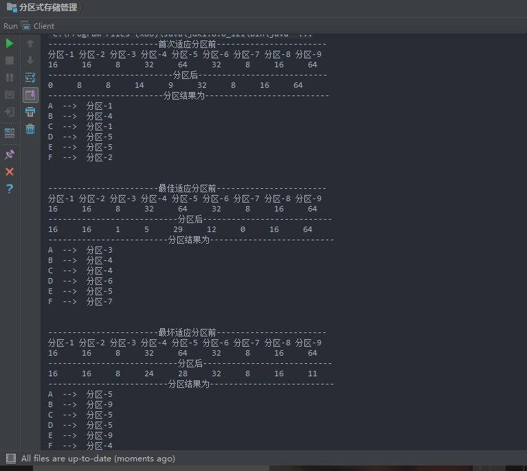

### 实验内容
---

#### 实验题目
分区式存储管理算法主要有：首次适应算法，最佳适应算法，最坏适应算法。

#### 实验目的
模拟实现分区存储管理算法中的首次、最佳、最坏适应算法。

#### 实验要求
输入： <br>
1）当前内存空闲分区的序列，包括起始地址、空闲分区大小。<br>
2）进程的分区请求序列。<br>
输出要求： <br>
1）	三种算法的空闲分区队列<br>
2）	三种算法的分配结果<br>

## 
#### 实验过程

**思路**

建立一个空闲分区类（Space），包括一些基本信息
```	
	private String name;
    private int firstAddress = 0;
    private  int size;
    private List<Work> list = new ArrayList<Work>();

    public Space(String name, int firstAddress, int size) {
        this.name = name;
        this.firstAddress = firstAddress;
        this.size = size;
    }

    // 添加作业到某个分区
    public void setList(Work work) {
        list.add(work);
    }

    public void setSize(int size) {
        this.size = size;
    }

    public int getSize() {
        return this.size;
    }

    public String getName() {
        return name;
    }
```
同时定义一个work类，存储一些作业的基本信息<br>
arryList作为存储作业
spaceList作为存储分区

1. 首次适应比较简单，直接在spacelist里面直接循环存储即可。
2. 最佳适应需要遍历spacelist里面的空间，找出最小空间，然后查看是否符合空间大小，符合条件将worklist的当前work存储到spacelist符合条件的space的List属性中。
3. 最坏适应于最佳相反，找到最大空间，然后与上述一样。


**运行结果**
	

#### 附录-代码 ####

main函数
```
import java.util.ArrayList;
import java.util.List;

public class Client {

    public static List<Work> workList = new ArrayList<Work>(); // 存储作业
    public static List<Space> spaceList = new ArrayList<Space>(); // 存储分区

    public static void  main(String[] args) {

        InitList();
        System.out.println("-----------------------首次适应分区前-----------------------");
        showSpaceName();
        showSpaceSize();
        FirstAdapt();
        System.out.println("--------------------------分区后---------------------------");
        showSpaceSize();
        System.out.println("------------------------分区结果为--------------------------");
        showWorkInSpace();

        InitList();
        System.out.println("\n" + "\n" + "-----------------------最佳适应分区前-----------------------");
        showSpaceName();
        showSpaceSize();
        BestAdapt();
        System.out.println("---------------------------分区后---------------------------");
        showSpaceSize();
        System.out.println("-------------------------分区结果为--------------------------");
        showWorkInSpace();

        InitList();
        System.out.println("\n" + "\n" + "-----------------------最坏适应分区前-----------------------");
        showSpaceName();
        showSpaceSize();
        WorstAdapt();
        System.out.println("---------------------------分区后---------------------------");
        showSpaceSize();
        System.out.println("-------------------------分区结果为--------------------------");
        showWorkInSpace();
    }

    public static void InitList(){
        workList.clear(); // 首先将初始化为空
        spaceList.clear();

        getSpaceInit(1,16);
        getSpaceInit(2,16);
        getSpaceInit(3,8);
        getSpaceInit(4,32);
        getSpaceInit(5,64);
        getSpaceInit(6,32);
        getSpaceInit(7,8);
        getSpaceInit(8,16);
        getSpaceInit(9,64);

        getWorkInit("A", 7);
        getWorkInit("B", 18);
        getWorkInit("C", 9);
        getWorkInit("D", 20);
        getWorkInit("E", 35);
        getWorkInit("F", 8);
    }
    // 得到SpaceList
    public static void getSpaceInit(int num, int size){
        Space space = new Space("分区-"+num,0, size);
        spaceList.add(space);
    }

    // 得到WorkList
    public static void getWorkInit(String name, int size){
        Work work = new Work(name, size);
        workList.add(work);
    }

    // 显示分区名字
    public static void showSpaceName() {
        for(int i=0; i<spaceList.size(); i++) {
            System.out.print(spaceList.get(i).getName() + " ");
        }
        System.out.println();
    }


    // 显示分区大小
    public static void showSpaceSize() {
        for(int i=0; i<spaceList.size(); i++) {
            System.out.print(spaceList.get(i).getSize() + "     ");
        }
        System.out.println();
    }

    // 显示作业所在分区
    public static void  showWorkInSpace() {
        for(int i=0; i<workList.size(); i++) {
            System.out.println(workList.get(i).getName() + "  -->  " + workList.get(i).getSpacename());
        }
    }

    // 首次适应
    public static void FirstAdapt() {
        for(int i=0; i<workList.size(); i++) {
            for(int j=0; j<spaceList.size(); j++) {
                // System.out.println(workList.get(i).getSize() + "          " + spaceList.get(j).getSize());
                if(workList.get(i).getSize() <= spaceList.get(j).getSize()) { // 满足空间条件的时候
                    workList.get(i).setSpacename(spaceList.get(j).getName()); // 将分区名添加到work中
                    spaceList.get(j).setList(workList.get(i)); // 将作业添加到分区中
                    spaceList.get(j).setSize(spaceList.get(j).getSize() - workList.get(i).getSize());
                    break;
                }
            }
        }
    }

    // 最佳适应
    public static void BestAdapt() {
        for(int i=0; i<workList.size(); i++) {
            int temp = -1;
            int size = 9999; // 设置size比workList的大
            for(int j=0; j<spaceList.size(); j++) {
                if(spaceList.get(j).getSize() >= workList.get(i).getSize() && spaceList.get(j).getSize() < size) {
                    // System.out.println(temp);
                    temp = j;
                    size = spaceList.get(j).getSize();
                }
            }
            if(temp != -1) {
                workList.get(i).setSpacename(spaceList.get(temp).getName());
                spaceList.get(temp).setList(workList.get(i)); // 将作业添加到分区中
                spaceList.get(temp).setSize(spaceList.get(temp).getSize() - workList.get(i).getSize());
            }

        }
    }

    // 最坏适应
    public static void WorstAdapt() {
        for(int i=0; i<workList.size(); i++) {
            int temp = -1;
            int size = 0; // 设置size比workList的大
            for(int j=0; j<spaceList.size(); j++) {
                if(spaceList.get(j).getSize() >= workList.get(i).getSize() && spaceList.get(j).getSize() > size) {
                    // System.out.println(temp);
                    temp = j;
                    size = spaceList.get(j).getSize();
                }
            }
            if(temp != -1) {
                workList.get(i).setSpacename(spaceList.get(temp).getName());
                spaceList.get(temp).setList(workList.get(i)); // 将作业添加到分区中
                spaceList.get(temp).setSize(spaceList.get(temp).getSize() - workList.get(i).getSize());
            }

        }
    }
}

```

work函数
```
public class Work {
    private String name;
    private String spacename = "";
    private int size;

    public Work(String name, int size) {
        this.name = name;
        this.size = size;
    }

    // 单独设置 spacename
    public void setSpacename(String spacename) {
        this.spacename = spacename;
    }

    public int getSize() {
        return this.size;
    }
    public String getName() {
        return name;
    }
    public  String getSpacename() {
        return this.spacename;
    }
}
```